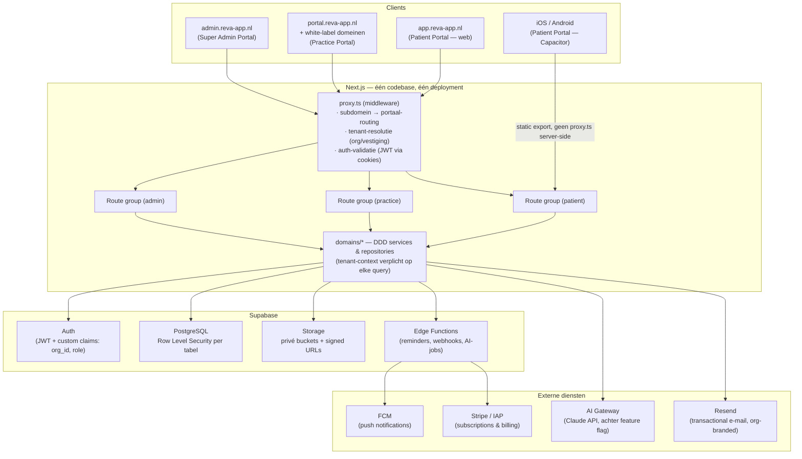
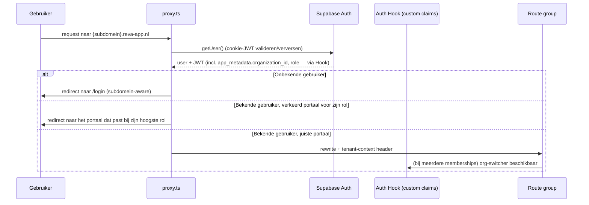

# REVA v2 — Master Architecture & Migratieplan

**Status:** Ter goedkeuring. Geen code gewijzigd — dit document is uitsluitend analyse en ontwerp.
**Auteur:** Lead Software Architect (Claude)
**Datum:** 2026-07-15
**Scope:** Doorontwikkeling van REVA (single-tenant patiënten-app) naar REVA v2 (multi-tenant SaaS-platform voor fysiotherapiepraktijken) met drie portalen op één codebase.

---

## Leeswijzer

1. [Analyse huidige codebase](#1-analyse-huidige-codebase)
2. [Doelarchitectuur — overzicht](#2-doelarchitectuur--overzicht)
3. [Platformstructuur (3 portalen)](#3-platformstructuur)
4. [Multi-tenant strategie](#4-multi-tenant-strategie)
5. [Rollen- en permissiemodel (RBAC)](#5-rollen--en-permissiemodel-rbac)
6. [Brandingarchitectuur](#6-brandingarchitectuur)
7. [Protocol Engine](#7-protocol-engine)
8. [Protocol- en oefeningenbibliotheek](#8-protocol--en-oefeningenbibliotheek)
9. [Subscriptionarchitectuur](#9-subscriptionarchitectuur)
10. [White-label strategie](#10-white-label-strategie)
11. [AI-uitbreidingsstrategie](#11-ai-uitbreidingsstrategie)
12. [Audit logging](#12-audit-logging)
13. [Databaseontwerp + ERD](#13-databaseontwerp--erd)
14. [Folderstructuur (DDD)](#14-folderstructuur-ddd)
15. [URL-structuur](#15-url-structuur)
16. [Authenticatieflow](#16-authenticatieflow)
17. [Security-aanbevelingen](#17-security-aanbevelingen)
18. [Performance-aanbevelingen](#18-performance-aanbevelingen)
19. [Architecture Decision Records](#19-architecture-decision-records-adrs)
20. [Migratieplan](#20-migratieplan)
21. [Roadmap met implementatiesprints](#21-roadmap-met-implementatiesprints)
22. [Openstaande beslissingen](#22-openstaande-beslissingen-voor-akkoord)

---

## 1. Analyse huidige codebase

REVA is vandaag een **volwassen single-tenant B2C patiënten-app**, geen MVP-demo meer: Next.js 16 (App Router, canary-build met `proxy.ts` i.p.v. `middleware.ts`), TypeScript, Supabase (Postgres + Auth + Storage + Edge Functions), en een Capacitor-laag die dezelfde codebase als static export naar iOS/Android verpakt. Er is één centrale state (`lib/store.tsx`), een consistente service-laag (`lib/services/*`), 14 SQL-migraties met RLS, en een (uitgeschakeld) subscriptiesysteem.

Onderstaand overzicht behandelt elk onderdeel met een concreet **behouden / verbeteren / vervangen / verwijderen**-advies.

### 1.1 Architectuur & platform

| Onderdeel | Bevinding | Advies |
|---|---|---|
| Next.js App Router + TypeScript | Moderne, goede basis. Canary-versie van Next.js met `proxy.ts` i.p.v. `middleware.ts` (functioneel identiek, alleen andere bestandsnaam-conventie). | **Behouden** als fundament voor v2. Wel: bij een volgende Next.js-major-upgrade expliciet valideren of `proxy.ts`-conventie nog geldt. |
| Alles client-side (`"use client"` overal) | Geen enkele pagina gebruikt Server Components of SSR-datafetching; alles gaat via de browser-Supabase-client. Dit is een bewuste keuze om zowel web (Vercel) als Capacitor (static export) uit dezelfde build te bedienen. | **Verbeteren, gefaseerd.** Voor v2 met een Practice/Admin Portal die *niet* naar Capacitor hoeft (alleen web) is er ruimte om daar wél Server Components + SSR-datafetching te gebruiken voor snellere eerste render en betere SEO/perf op grote datasets (patiëntenlijsten). Patient Portal blijft client-side i.v.m. Capacitor-export. |
| Capacitor static-export voor iOS/Android | Werkt via `NEXT_BUILD_TARGET=capacitor`, `output:"export"`, met prebuild/postbuild scripts die server-only routes tijdelijk verplaatsen. Functioneel en goed gedocumenteerd. | **Behouden**, geïsoleerd tot de Patient Portal-routegroep. Admin/Practice Portal hoeven nooit naar Capacitor geëxporteerd te worden — dat ontkoppelt hun technische constraints. |
| `lib/supabaseServer.ts` (cookie-based SSR-client) | Volledig **dead code** — nul imports in de hele repo. Beide API-routes bouwen zelf een ad-hoc bearer-token client. | **Vervangen**: in v2 is een correcte SSR-cookie-client wél nodig (voor Server Components in Admin/Practice Portal en voor tenant-resolutie in `proxy.ts`). Herbouwen volgens het huidige `@supabase/ssr`-patroon, maar dan daadwerkelijk gebruikt. |
| CSP / security headers | Aanwezig voor web-build, expliciet (en correct gedocumenteerd) genegeerd bij `output:"export"`. | **Behouden en uitbreiden** naar de nieuwe subdomeinen (admin/portal/app), zie §17. |

### 1.2 Database & Supabase-inrichting

| Onderdeel | Bevinding | Advies |
|---|---|---|
| Tabelmodel | 19 tabellen, allemaal met een direct `user_id uuid REFERENCES auth.users`. **Geen enkel concept van organisatie, vestiging, therapeut-koppeling of rol bestaat.** Elke rij is 1:1 eigendom van precies één eindgebruiker. | **Vervangen door multi-tenant model.** Dit is geen uitbreiding maar een fundamentele herstructurering: elke patiëntgebonden tabel krijgt `organization_id`, `location_id` en `patient_id` (i.p.v. rechtstreeks `user_id`). Zie §4 en §13. Bestaande tabellen (checkins, appointments, medication_*, training_*, dossier_*, goals, milestones) blijven qua *velden* grotendeels **behouden** — alleen de eigenaarschapskolommen veranderen. |
| RLS-patroon | Consistent `auth.uid() = user_id` op elke tabel, met een correct "indirect ownership via EXISTS"-patroon voor junction-tabellen (`training_schema_exercises`, `medication_schedule_times`). Kwalitatief goed toegepaste RLS, alleen voor het verkeerde (single-tenant) datamodel. | **Vervangen** door tenant-aware policies (org/location/patient-scoped, plus rol-gebaseerde therapeut-toegang). Het *patroon* (élke tabel expliciet RLS, defensieve `IF NOT EXISTS`-migraties, indirect ownership via `EXISTS`) is een sterk precedent en wordt **behouden als conventie**. |
| Storage (`dossier-photos`, `dossier-documents`) | Migratie 013 documenteert en repareert een **echt datalek**: buckets stonden `public=true` en SELECT-policies checkten alleen `bucket_id`, niet het pad — elke ingelogde gebruiker kon andermans bestanden lezen. Inmiddels privé + pad-gescoped policies + signed URLs (1 uur TTL). | **Behouden als patroon** (privé bucket + signed URL + pad-ownership-check) en toepassen op elke nieuwe bucket in v2 (org-logo's, protocol-video's, therapeut-documenten). Expliciet als lesson-learned meenemen in de security-review van elke nieuwe bucket. |
| Edge Function `send-checkin-reminder` | Eén Deno-function, cron-getriggerd (buiten repo geconfigureerd), stuurt FCM-pushes op basis van 6 triggers. Leest `medication_schedules.times` (legacy jsonb) i.p.v. de genormaliseerde junction-tabel — een sync-afhankelijkheid. | **Verbeteren**: bij de multi-tenant migratie de query's tenant-aware maken en de legacy-jsonb-afhankelijkheid opruimen (zie 1.4). Patroon van scheduled Edge Functions met een gedeeld secret (`x-cron-secret`) i.p.v. de anon-key als auth **behouden**. |
| Kolom-lockdown trigger (migratie 014) | Voorkomt dat gebruikers zichzelf gratis Premium geven door direct naar `settings`-kolommen te schrijven. Goed doordacht, `service_role`-only write. | **Behouden als patroon**, uitbreiden naar alle nieuwe entitlement/abonnementskolommen op organisatieniveau (zie §9, §17). |
| Legacy/dode schema-onderdelen | `diary_workouts`-tabel (vervangen door `training_logs`, nog aanwezig voor backward compat), `medication_schedules.times` jsonb (vervangen door junctietabel), `training_schemas.exercise_ids` jsonb (vervangen door junctietabel). | **Verwijderen** tijdens de v2-migratie (na verificatie dat er geen productiedata meer op leunt) — dit is een goed moment om schone tabellen te introduceren i.p.v. legacy mee te slepen. |
| `app/api/delete-account/route.ts` | Hardcoded lijst van 16 tabellen die *handmatig* in sync gehouden moet worden met `schema.sql`. Zelf gedocumenteerd risico. | **Verbeteren**: in v2 vervangen door `ON DELETE CASCADE` vanaf `patients`/`memberships` zodat verwijdering structureel geborgd is i.p.v. een handmatige lijst. |

### 1.3 Authenticatie & middleware

| Onderdeel | Bevinding | Advies |
|---|---|---|
| `proxy.ts` (= middleware) | Correct `@supabase/ssr`-patroon: cookie-refresh, `getUser()`-validatie, redirect-logica, trailing-slash-fix voor static export, `/api` bewust uitgesloten. Sterk stuk code. | **Behouden en uitbreiden**: wordt in v2 de plek waar ook *tenant-resolutie* (subdomein → organisatie) en *rol-routing* (welk portaal hoort bij deze gebruiker) gebeurt. Zie §15/§16. |
| Twee-laags auth-gate | Server-side (`proxy.ts`) + client-side (`AuthGate.tsx`) — functioneel correct maar met overlappende verantwoordelijkheid. | **Verbeteren**: in v2 client-side gate vooral gebruiken voor onboarding-redirects, tenant/rol-checks primair server-side (middleware + RLS) laten afdwingen zodat de client-check een UX-laag is, geen security-laag. |
| Rollen/permissies | **Bevestigd: bestaan niet.** Enige privilege-achtige concept is een hardcoded `DEV_EMAILS`-allowlist in `lib/subscription.ts` voor gratis Premium. | **Vervangen** door het RBAC-systeem uit §5. De dev-allowlist-hack **verwijderen** zodra een echt rollensysteem er is. |
| Social login (Google OAuth) + Capacitor deep-link flow | Correct geïmplementeerd voor zowel web als native (custom URL scheme `com.reva.mobile://auth/callback`). | **Behouden.** |

### 1.4 State management & data-laag

| Onderdeel | Bevinding | Advies |
|---|---|---|
| `lib/store.tsx` — één grote React Context | Alle 12 domeincollecties worden bij login **volledig** ingeladen (`Promise.all`) in één client-side context. Voor één patiënt met een beperkte dataset werkt dit uitstekend en is het overzichtelijk. | **Behouden voor de Patient Portal** (blijft één patiënt, beperkte datasetgrootte, en het huidige patroon is hydration-safe en goed doordacht). **Niet hergebruiken voor Practice/Admin Portal**: een therapeut die duizenden patiënten moet kunnen doorzoeken/filteren/pagineren kan niet alles in één in-memory context laden. Daar geldt een query-gebaseerd model (zie §14). |
| Service-laag (`lib/services/*`) | Zeer consistent handgeschreven patroon: elke functie een expliciete `userId`-parameter, `.eq("user_id", userId)` als defense-in-depth naast RLS, gedeelde `logErr()`-helper, insert/update/upsert-triade. Geen ORM, geen query-builder-abstractie. | **Vervangen door een repository-laag met verplichte tenant-context** (`{ organizationId, locationId, patientId, actor }`) i.p.v. losse `userId`-parameters. Dit is de kern van waarom "gewoon user_id vervangen door organization_id" niet volstaat: met ~60 functies die stuk voor stuk `.eq("user_id", userId)` hebben, moet dat overal individueel worden aangepast. Een centrale scoping-laag (zie §14) voorkomt dat dit bij elke volgende uitbreiding weer los gebeurt. Het *style*-DNA (expliciete mappers, consistente foutafhandeling, geen magic) **behouden**. |
| `lib/db/types.ts` + `mappers.ts` | Compile-time snake_case↔camelCase mapping, geen runtime-validatie (geen Zod). | **Verbeteren**: Zod-schemas invoeren per domein-entiteit zodat schema-drift (vooral relevant zodra meerdere teams/portalen tegen dezelfde tabellen schrijven) een build-/runtime-fout geeft i.p.v. een stille `undefined`. |
| Notificaties (`lib/notifications.ts`) | Puur functioneel, deterministisch, nooit gepersisteerd (alleen read/logged-ids). Slim ontworpen. | **Behouden als patroon**, uitbreiden met organisatie-/therapeut-afkomstige notificaties (berichten, protocol-updates) in v2. |
| AI-coach (`lib/coach.ts`) | Regelgebaseerd, expliciet zo gedocumenteerd dat het later door een echte AI-service vervangen kan worden zonder de returnvorm (`CoachInsights`) te wijzigen. | **Behouden als contract/interface**, implementatie evolueert naar §11 (AI Gateway). Dit is precies het juiste patroon om op voort te bouwen. |
| Feature-flags/subscriptions (`lib/subscription.ts`, `lib/featureGates.ts`) | Volledig gebouwd systeem, maar **uitgeschakeld** (`SUBSCRIPTIONS_ENABLED = false`) en uitsluitend client-side afgedwongen — geen enkele server-side/RLS-handhaving van planlimieten. | **Vervangen** door organisatie-niveau subscriptions met server-side afdwinging (zie §9). Het bestaande UI-patroon (`FeatureLock`, `UpgradeModal`, `TrialBanner`) is **herbruikbaar** als visuele laag. |

### 1.5 Componenten & design system

| Onderdeel | Bevinding | Advies |
|---|---|---|
| `components/ui/*` (10 componenten) | Functioneel, zelfgebouwde `DatePicker`/`TimePicker` met portal-positionering. Styling is **overal inline hex-kleuren** (`style={{color:"#e8632a"}}`) i.p.v. design tokens/CSS-variabelen. | **Verbeteren, niet weggooien**: componenten blijven, maar styling wordt omgezet naar CSS-variabelen/design tokens — noodzakelijk zodra branding per organisatie dynamisch moet zijn (§6). Inline hex-kleuren kunnen letterlijk niet per organisatie overschreven worden zonder dit refactor. |
| Modal-componenten (`CheckInModal`, `AppointmentModal`, `InnameModal`, `TrainingModal`) | Consistent lazy-loaded via `next/dynamic(..., {ssr:false})`, maar de boilerplate is 4× gedupliceerd i.p.v. gecentraliseerd. `InnameModal.tsx` doubles als shared-utility-module (ongebruikelijke co-locatie). | **Verbeteren**: centraliseren in een `useLazyModal()`-achtig patroon; gedeelde form-primitives (`FieldLabel`, `FormInput`, etc.) verhuizen naar `components/ui`. Kleine, low-risk opschoning. |
| Sidebar/MobileNav/TopBar | Duidelijke desktop/mobiel-scheiding, goed navigatiepatroon. | **Behouden** als basis voor de Patient Portal-navigatie; Practice/Admin Portal krijgen een eigen navigatiestructuur (andere informatiearchitectuur: patiëntenlijsten, agenda, rapportages). |

### 1.6 Samenvatting: sterke en zwakke punten

**Sterke punten** — een goede basis om op te bouwen:
- Consistente, gedisciplineerde code-conventies (mappers, services, RLS-per-tabel, defensieve migraties).
- Al een keer een echt security-incident (storage-lek) gevonden én correct gerepareerd — een team/codebase die security serieus neemt.
- Slim ontworpen "vervang dit later door AI"-interfaces (`coach.ts`).
- Werkende multi-platform strategie (web + Capacitor uit één codebase).
- Volledig Nederlandstalige, doordachte domeinmodellering (`lib/data.ts`) die 1-op-1 aansluit op de functionele eisen uit `CLAUDE.md`.

**Zwakke punten** — het fundamentele werk voor v2:
- Nul multi-tenant primitieven: dit is de kern van de opdracht en vereist een schema-, RLS- en service-laag-herontwerp, geen uitbreiding.
- Eigenaarschap zit hardcoded verspreid over ~60 servicefuncties i.p.v. centraal afgedwongen — moet worden opgelost vóórdat multi-tenant schaalt.
- Subscriptiesysteem is UI-only, niet serverside afgedwongen.
- Geen runtime-schemavalidatie.
- Styling niet themeable (blokkerend voor branding per organisatie).
- `lib/supabaseServer.ts` dood, `delete-account`-tabellenlijst een handmatig onderhoudspunt.

---

## 2. Doelarchitectuur — overzicht



**Kernprincipes:**
1. **Eén codebase, één Next.js-deployment**, drie portalen als aparte route groups, onderscheiden via subdomein-detectie in `proxy.ts`.
2. **Shared database, shared schema, rij-niveau tenant-isolatie via RLS** — geen schema-per-tenant of database-per-tenant (zie ADR-01).
3. **Elke query loopt door een tenant-context** — nooit direct `supabase.from(...)` in een pagina/component; altijd via `domains/*/repository.ts`.
4. **Feature flags en rollen zijn data, geen code** — nieuwe rollen/plannen/features vereisen rijen, geen migraties (waar redelijkerwijs mogelijk).

---

## 3. Platformstructuur

### 3.1 Super Admin Portal (`admin.reva-app.nl`)
Platformbeheer, niet org-gescoped. Functionaliteit zoals gespecificeerd: dashboard, organisaties, vestigingen, abonnementen, facturatie, analytics, support, gebruikersbeheer, impersonate, platforminstellingen.

- Toegang uitsluitend voor `platform_admins` (zie §5) — geen enkele organisatie-RLS-context, wel een eigen strikte RLS/servicerol-laag.
- **Impersonate organisatie**: een tijdelijke, geauditeerde sessie waarin de Super Admin de Practice Portal ziet zoals een specifieke Organization Owner die zou zien. Technisch: een kortlevende, apart gemarkeerde sessie-claim (`impersonating_org_id`) + verplichte audit-log-entry bij start én einde + permanente UI-banner ("Je bekijkt dit als [Organisatie]") zodat het nooit onopgemerkt gebeurt.

### 3.2 Practice Portal (`portal.reva-app.nl`, straks ook white-label domeinen)
Het eigenlijke SaaS-product. Dashboard, patiënten, therapeuten, protocolbibliotheek, oefeningen, berichten, rapportages, branding, instellingen, agenda, documenten — precies zoals gespecificeerd.

- Org-gescoped: alles wat een gebruiker hier ziet is gefilterd op zijn `organization_id` (en eventueel `location_id`) via RLS + repository-laag.
- Rol-afhankelijke UI: een Reception-rol ziet de agenda en patiëntcontactgegevens maar geen medisch dossier; een Therapeut ziet zijn eigen patiënten volledig.

### 3.3 Patient Portal (`app.reva-app.nl` + iOS/Android)
De huidige REVA-app, functioneel ongewijzigd qua schermen (§ van `CLAUDE.md`: dashboard, tijdlijn, dossier, afspraken, check-in, training, medicatie, analyse, instellingen), maar nu:
- Gekoppeld aan `organization_id`, `location_id`, `therapist_id` (nullable — een patiënt kan zonder koppeling starten, precies zoals de huidige flow, en later gekoppeld worden).
- Branding wordt bij het laden automatisch overgenomen van de gekoppelde organisatie/vestiging (§6).
- Blijft technisch de Capacitor-geëxporteerde route group; enige portaal dat naar native mobiel gaat.

---

## 4. Multi-tenant strategie

### 4.1 Hiërarchie

```
Platform
  └─ Organization        (een fysiotherapiepraktijk / keten)
       └─ Location        (fysieke vestiging)
            └─ Membership  (staff-gebruiker + rol, gekoppeld aan org, optioneel vestiging)
            └─ Patient     (patiëntrecord; optioneel gekoppeld aan een auth-gebruiker voor portal-toegang)
```

Een **Organization** kan meerdere **Locations** hebben (multi-vestiging, feature-flagged per abonnement — zie §9). Een **Patient** is altijd eigendom van een Organization en optioneel gekoppeld aan een Location en een primaire Therapeut. Een **Membership** koppelt een `auth.users`-account aan een Organization (+ optioneel Location) met een Rol — één gebruiker kan meerdere memberships hebben (bv. een therapeut die bij twee praktijken werkt).

### 4.2 Isolatiestrategie: shared schema + RLS (niet schema-per-tenant)

**Gekozen aanpak:** één gedeelde Postgres-database, één schema, elke tenant-gebonden tabel heeft een `organization_id`-kolom, en Row Level Security dwingt isolatie af op rijniveau. Zie ADR-01 voor de volledige afweging tegen schema-per-tenant en database-per-tenant.

Kort samengevat: bij "duizenden organisaties" is schema-per-tenant in Postgres een operationeel probleem (migraties moeten duizenden keren worden uitgevoerd, connection pooling en `pg_catalog`-overhead schalen slecht, Supabase's tooling is niet op dit patroon ingericht). Shared-schema-met-RLS is het bewezen Supabase-patroon op deze schaal en sluit direct aan op wat er nu al (single-tenant) staat.

### 4.3 Performante RLS op schaal: JWT custom claims

Met honderdduizenden patiënten en duizenden organisaties is een RLS-policy die bij elke rij een subquery naar een `memberships`-tabel doet (`organization_id IN (SELECT organization_id FROM memberships WHERE user_id = auth.uid())`) een reëel performance-risico op grote tabellen (check-ins, training-logs).

**Aanbeveling:** een Supabase **Auth Hook (Custom Access Token Hook)** die bij het uitgeven van een JWT de actieve `organization_id`, `location_id` en `role`-claims in de token zelf plaatst. RLS-policies lezen dan `auth.jwt() -> 'app_metadata' ->> 'organization_id'` — een claim-lookup, geen join. Bij een membership-wijziging wordt de sessie ge-refreshed (Supabase ondersteunt dit via `auth.refresh_session` / een korte JWT-levensduur + refresh-cyclus).

Voor gebruikers met **meerdere** memberships (bv. therapeut bij twee praktijken) bevat de JWT de actief-gekozen organisatie (een "werk als [organisatie]"-switcher in de Practice Portal, vergelijkbaar met hoe Vercel/Linear tussen teams wisselt); de volledige lijst van memberships blijft in de `memberships`-tabel voor de switcher-UI.

**Fasering (§22, besluit 4):** dit is doelarchitectuur, geen v1-vereiste. v1 gebruikt de subquery-vorm (`organization_id IN (SELECT ... FROM memberships WHERE user_id = auth.uid())`) met een expliciete index op `memberships(user_id, organization_id)` — bij de verwachte schaal van de eerste praktijken (tientallen tot honderden gebruikers) is dit ruim voldoende performant. De overstap naar JWT-claims is een zuivere policy-implementatiewijziging, geen schema- of API-wijziging, en wordt getriggerd door gemeten p95-latency of een groeiend aantal organisaties, niet vooraf gepland.

### 4.4 Patiënttoegang (eigen data)

Een patiënt bevraagt niet via `organization_id` maar via zijn eigen `patient_id` (net als vandaag via `user_id`). RLS-policy: `patients.user_id = auth.uid()` voor het eigen patiëntrecord, en op child-tabellen (check-ins, afspraken, etc.) een indirect-ownership-check op `patient_id` — exact het patroon dat vandaag al correct wordt toegepast voor junction-tabellen, nu toegepast op alle patiëntdata.

Therapeuten/organisatiestaf krijgen **aanvullende** policies (naast de patiënt-eigen-policy) die toegang geven op basis van hun membership + rol + eventueel een expliciete `patient_id`-toewijzing (`primary_therapist_user_id` of een `patient_assignments`-tabel voor gedeelde caseload).

---

## 5. Rollen- en permissiemodel (RBAC)

### 5.1 Ontwerpprincipe

Rollen en permissies zijn **data, niet code** — nieuwe rollen kunnen worden toegevoegd door rijen toe te voegen aan `roles`/`permissions`/`role_permissions`, zonder schemawijziging. Dit voldoet direct aan de eis "nieuwe rollen moeten later toegevoegd kunnen worden zonder grote databasewijzigingen."

### 5.2 Model

- **`roles`**: `id, key, name, scope ('platform'|'organization'|'location'), is_system boolean`. Systeemrollen (`super_admin`, `organization_owner`, `organization_admin`, `finance`, `location_manager`, `therapist`, `assistant`, `reception`, `patient`) worden geseed; organisaties kunnen op termijn **eigen aangepaste rollen** aanmaken binnen hetzelfde model (post-v2-scope, maar het model staat het toe zonder wijziging).
- **`permissions`**: granulaire capabilities, bv. `patients.view`, `patients.edit`, `protocols.publish`, `billing.manage`, `reports.export`. Key-based, niet enum-based, zodat nieuwe permissies zonder migratie toegevoegd kunnen worden.
- **`role_permissions`**: junction table.
- **`memberships`**: `user_id, organization_id, location_id (nullable), role_id, status ('active'|'invited'|'suspended'), created_at`. Eén gebruiker kan meerdere rijen hebben (meerdere organisaties/rollen).
- **`platform_admins`**: aparte, kleine tabel (`user_id`) voor Super Admins — bewust **niet** in `memberships` gestopt, omdat platformbeheer geen organisatiecontext heeft. Dit voorkomt dat een RLS-bug in de organisatie-scoping ooit per ongeluk platform-brede rechten lekt.

### 5.3 Rollen (initiële set, uit de opdracht)

| Niveau | Rol | Typische permissies |
|---|---|---|
| Platform | `super_admin` | Alles, platformbreed, buiten de normale org-RLS om (via `service_role`-achtige policy-uitzondering, altijd geaudit) |
| Organisatie | `organization_owner` | Volledig beheer eigen organisatie, billing, alle vestigingen |
| Organisatie | `organization_admin` | Beheer organisatie, geen billing |
| Organisatie | `finance` | Alleen facturatie/abonnement, geen patiëntdata |
| Vestiging | `location_manager` | Volledig beheer eigen vestiging |
| Vestiging | `therapist` | Eigen patiënten (caseload), protocollen toewijzen, berichten |
| Vestiging | `assistant` | Beperkt: uitvoeren, geen protocol-config |
| Vestiging | `reception` | Agenda, patiëntcontactgegevens, géén medisch dossier |
| Patiënt | `patient` | Uitsluitend eigen data (Patient Portal) |

### 5.4 Handhaving op twee lagen

1. **RLS (database)** — de harde grens; zelfs een bug in de applicatielaag kan geen cross-tenant data lekken.
2. **Permissie-check in de repository/service-laag (`domains/*/service.ts`)** — voor UX (nette foutmeldingen i.p.v. lege RLS-resultaten) en voor acties die geen directe tabel-rij zijn (bv. "protocol publiceren").

Nooit permissies **uitsluitend** client-side afdwingen (zoals de huidige `SUBSCRIPTIONS_ENABLED`-flag dat doet) — dat is een expliciete les uit §1.4.

---

## 6. Brandingarchitectuur

### 6.1 Model
- **`organization_branding`**: `organization_id, logo_url, favicon_url, primary_color, secondary_color, accent_color, font_family, email_from_name, email_style jsonb`.
- **`location_branding`**: zelfde velden, `location_id`, alle velden nullable — een vestiging kan branding overnemen van de organisatie of individuele velden overschrijven.

### 6.2 Resolutie
Bij het laden van de Patient Portal (en publieke org-pagina's) wordt branding resolved in volgorde: `location_branding` (indien patiënt aan vestiging gekoppeld en veld niet-null) → `organization_branding` → REVA-platform-default. Deze resolutie gebeurt server-side in `proxy.ts`/een layout-loader zodat er geen flits van verkeerde branding is (vergelijkbaar met hoe `hydrated` vandaag flash-of-wrong-content voorkomt).

### 6.3 Technische vereiste: design tokens i.p.v. inline hex
Zoals gesignaleerd in §1.5 is dit **blokkerend**: de huidige inline-hex-styling kan letterlijk niet dynamisch per organisatie worden. v2 vereist CSS custom properties (`--color-primary`, etc.) die server-side per request/tenant worden geïnjecteerd (`<style>`-tag in de layout of een `data-org`-attribute + CSS-variabelen-scope). Dit is een noodzakelijke refactor van `components/ui/*`, niet optioneel.

---

## 7. Protocol Engine

### 7.1 Kernconcept
Een **protocol** bestaat uit geordende **fasen**; elke fase bevat **items** van verschillende typen (oefening, video, document, reminder, check-in, bericht, vragenlijst, mijlpaal). Patiënten doorlopen fasen automatisch op basis van een startdatum (bv. operatiedatum); therapeuten kunnen handmatig afwijken (fase vervroegen/verlengen, items toevoegen/verwijderen voor één specifieke patiënt zonder het bronprotocol te wijzigen).

### 7.2 Model
- **`protocols`**: `id, scope ('reva'|'organization'|'location'), organization_id (nullable), location_id (nullable), source_protocol_id (nullable, self-ref)`, naam, omschrijving, injury-categorie, status (draft/published/archived).
- **`protocol_phases`**: `protocol_id, sort_order, name, trigger_type ('days_from_start'|'manual'|'milestone_completed'), trigger_value`.
- **`protocol_phase_items`**: `phase_id, item_type, ref_id (verwijst naar exercise/document/etc.), config jsonb, sort_order`.
- **`patient_protocols`**: toewijzing van een protocol aan een patiënt: `patient_id, protocol_id, start_date, current_phase_id, status, is_customized boolean`.
- **`patient_protocol_overrides`**: per-patiënt afwijkingen (item toegevoegd/verwijderd/fase-datum aangepast) zonder het bronprotocol te muteren — dit is het mechanisme dat "therapeuten kunnen hiervan afwijken" zonder de duplicatie-hiërarchie te breken.
- **`patient_protocol_phase_progress`**: voortgang per fase per patiënt (`started_at, completed_at, status`) — voedt de Analyse-module en het therapeut-dashboard.

### 7.3 Automatische voortgang
Een dagelijkse (of on-demand) Edge Function/cron berekent per `patient_protocols`-rij of de huidige fase, op basis van `trigger_type`/`trigger_value` en de patiënt-startdatum, moet doorschuiven naar de volgende fase, en genereert de bijbehorende notificaties/reminders/check-in-verzoeken. Dit is een uitbreiding van het bestaande `send-checkin-reminder`-Edge-Function-patroon, niet een nieuw paradigma.

De bestaande hardcoded templates (`lib/mijlpalenTemplates.ts`, `lib/trainingTemplates.ts`) zijn functioneel **exact** wat de REVA-library-laag van de Protocol Engine moet worden — zie §20 (migratieplan, fase 4) voor hoe deze 1-op-1 worden omgezet naar seed-data.

---

## 8. Protocol- en oefeningenbibliotheek

Beide bibliotheken volgen hetzelfde drielaags-model, gespiegeld aan de organisatiehiërarchie:

```
REVA Library        (scope='reva', organization_id=null — door platform beheerd, alle orgs kunnen lezen)
    ↓ dupliceren
Organization Library (scope='organization', organization_id=X, source_*_id → origineel)
    ↓ dupliceren
Location Library     (scope='location', location_id=Y, source_*_id → origineel)
```

- **Dupliceren behoudt lineage** via `source_protocol_id`/`source_exercise_id` — het origineel wijzigt nooit mee, en de UI kan tonen "gebaseerd op REVA-protocol X" en eventueel toekomstige REVA-updates signaleren zonder ze automatisch te forceren.
- `exercises` volgt exact hetzelfde patroon als `protocols` (zelfde drie scopes, zelfde duplicatie-mechaniek), inclusief video/media-referenties naar Storage.
- Zichtbaarheid volgt de hiërarchie omgekeerd: een Location ziet REVA + eigen Organization + eigen Location library; REVA content is nooit editable buiten het platform.

---

## 9. Subscriptionarchitectuur

### 9.1 Model
- **`subscription_plans`**: `key ('starter'|'professional'|'enterprise'), name, price, billing_interval, is_active`.
- **`plan_features`**: `plan_id, feature_key, limit_value jsonb` — bv. `{"max_locations": 1}`, `{"ai_enabled": false}`, `{"api_access": false}`, `{"white_label": false}`, `{"storage_gb": 10}`, `{"advanced_reports": false}`.
- **`organization_subscriptions`**: `organization_id, plan_id, status, stripe_customer_id, stripe_subscription_id, current_period_end, seats`.
- **`organization_feature_overrides`**: per-organisatie uitzonderingen bovenop het plan (voor sales-deals/pilots) — `organization_id, feature_key, value jsonb`.

### 9.2 Feature flags: voorbeelden uit de opdracht
`ai`, `multi_location`, `api_access`, `white_label`, `extra_storage`, `advanced_reports` — elk een `feature_key` in `plan_features`, resolved via: override → plan → default (false). Eén centrale `hasFeature(organizationId, featureKey)`-functie (server-side, met caching op de JWT-claims of een korte-TTL-cache) i.p.v. verspreide checks.

### 9.3 Server-side afdwinging (de fix voor het huidige gat)
In tegenstelling tot het huidige systeem (§1.4: uitsluitend client-side, `SUBSCRIPTIONS_ENABLED=false`) wordt in v2 elke harde limiet (aantal vestigingen, aantal therapeuten, opslag) **ook** afgedwongen via een Postgres-trigger of RLS-`WITH CHECK`-conditie die het plan-limiet raadpleegt — analoog aan de bestaande, bewezen kolom-lockdown-trigger uit migratie 014. De client-side `FeatureLock`/`UpgradeModal`-componenten blijven bestaan voor UX, maar zijn nooit de enige grens.

### 9.4 Billing-integratie
Schema is er al op voorbereid (`subscription_source: stripe|google_play|apple`), maar niet geïmplementeerd. v2 voegt een Stripe-webhook-Route-Handler toe (`app/api/webhooks/stripe/route.ts`, service-role, buiten de normale RLS/auth-flow om net als het bestaande `delete-account`-patroon) die `organization_subscriptions` bijwerkt. Mobiele IAP (Google Play/Apple) blijft voor patiënt-niveau-aankopen relevant indien REVA ooit een patiënt-betaald model naast het organisatie-abonnement introduceert — voor nu is de organisatie de betalende entiteit, patiënten niet.

---

## 10. White-label strategie

Architectuur wordt vanaf v2 zo opgezet dat de onderstaande punten **later** toegevoegd kunnen worden zonder herontwerp:

- **Eigen domeinen**: `organizations.custom_domain` (nullable, unique). `proxy.ts` resolvet tenant zowel via bekend subdomein-patroon (`*.reva-app.nl`) als via een lookup op `custom_domain`. Vercel ondersteunt wildcard + custom-domain-toewijzing per project zonder herdeploy; SSL wordt automatisch geregeld.
- **Eigen loginpagina**: de Practice/Patient Portal login-route leest branding vóór render (zelfde resolutiepad als §6) — geen aparte codepath nodig, alleen dat branding-resolutie ook op de (unauthenticated) loginroute draait.
- **Eigen e-mails**: `organization_branding.email_from_name` + `email_style` worden meegegeven aan de Resend-integratie (reeds in gebruik voor feedback-mail); een e-mail-template-laag met org-branding-injectie i.p.v. het huidige hardcoded template.
- **Eigen favicon**: al onderdeel van `organization_branding` (§6), server-side geïnjecteerd via `app/icon.tsx`-equivalent per tenant (dynamische `ImageResponse`, zelfde techniek als het bestaande `app/icon.tsx`/`apple-icon.tsx`, nu tenant-parameterized — let op: deze routes worden bij Capacitor-builds uitgesloten, wat geen probleem is aangezien white-label alleen relevant is voor web/Practice Portal, niet de patiënt-app).
- **Eigen branding**: reeds volledig gedekt door §6.

Geen van deze punten vereist een schema- of architectuurwijziging wanneer ze daadwerkelijk gebouwd worden — het datamodel (§13) bevat de benodigde kolommen vanaf v2, ook al wordt de functionaliteit pas in een latere sprint (zie §21) actief gebouwd.

---

## 11. AI-uitbreidingsstrategie

### 11.1 Plaatsing in de architectuur
Een nieuw domein `domains/ai/` fungeert als **AI Gateway**: een providerneutrale interface-laag die andere domeinen aanroepen (protocol engine, coach, messaging, analytics), zodat het onderliggende model/provider kan wijzigen zonder callers te raken — exact het principe dat `lib/coach.ts` vandaag al voor de regelgebaseerde coach hanteert.

```
domains/coach/service.ts  ──uses──▶  domains/ai/gateway.ts  ──calls──▶  AI provider (achter feature flag)
domains/messaging/service.ts (AI-samenvattingen)  ─┘
domains/protocols/service.ts (AI-protocolsuggesties) ─┘
domains/analytics/service.ts (AI-aanbevelingen) ─┘
```

### 11.2 Voorbeelden en waar ze passen
| AI-feature | Consumeert | Plaatsing |
|---|---|---|
| AI herstelcoach | check-ins, training-logs, protocol-voortgang | Vervangt/verrijkt `lib/coach.ts`-implementatie achter hetzelfde `CoachInsights`-contract |
| AI-samenvattingen | notities, check-ins, berichten tussen therapeut/patiënt | `domains/messaging` — samenvatting voor therapeut vóór consult |
| AI-protocollen | oefeningen-/protocolbibliotheek + patiëntprofiel | `domains/protocols` — suggestie bij het aanmaken van een nieuw protocol, therapeut keurt altijd goed vóór publicatie |
| AI-verslaglegging | afspraak-uitkomsten, voortgang | `domains/appointments` — concept-verslag, therapeut redigeert |
| AI-aanbevelingen | analytics-data | `domains/analytics` — trend-signalering ("pijnscore stijgt 3 dagen op rij") |

### 11.3 Randvoorwaarden
- AI-features zijn een **subscription feature flag** (`ai`, zie §9) — nooit standaard aan voor elk plan.
- Alle AI-aanroepen lopen server-side (Route Handler of Edge Function), nooit rechtstreeks vanuit de client — voorkomt sleutel-lekkage en maakt audit-logging van AI-gebruik mogelijk (relevant voor medische context: elke AI-suggestie die aan een patiënt wordt getoond, wordt gelogd wie het initieerde en welk model/versie het genereerde).
- Medisch-inhoudelijke AI-output (samenvattingen, protocolsuggesties) is **altijd voorstel, nooit auto-published** zonder therapeut-goedkeuring — sluit aan bij de bestaande disclaimer-praktijk in `lib/coach.ts` ("geen medisch advies").
- Voor het model/provider zelf: geen keuze vastleggen in dit document — dat is een implementatiedetail van `domains/ai/gateway.ts` en kan per omgeving/versie wijzigen zonder impact op de rest van de architectuur.

**Besluit (§22, besluit 6):** de AI Gateway wordt vanaf Fase 0 als lege interface-laag meegenomen in de domeinstructuur (`domains/ai/`), zodat er later geen herstructurering nodig is. Er wordt echter **geen AI-functionaliteit gebouwd vóór de eerste praktijken live zijn** — dit is bewust geen kritiek-pad-item voor de MVP. De eerste daadwerkelijke feature, zodra die aan de beurt is, is een **automatische samenvatting van patiëntvoortgang** voor therapeuten (samenvatting van check-ins/notities/training vóór een consult) — hoogste waarde-per-risico-verhouding: bespaart therapeuttijd, raakt geen klinische besluitvorming, en consumeert data die al bestaat (geen nieuwe dataverzameling nodig).

---

## 12. Audit logging

### 12.1 Model
**`audit_logs`**: `id, organization_id (nullable — null bij platform-acties), location_id (nullable), actor_user_id, actor_role, action (bv. 'patient.updated', 'protocol.published', 'impersonation.started'), entity_type, entity_id, before jsonb, after jsonb, ip_address (optioneel), created_at`.

### 12.2 Eigenschappen
- **Append-only**: RLS staat uitsluitend `INSERT` toe (via `service_role` of een `SECURITY DEFINER`-functie aangeroepen vanuit de service-laag), nooit `UPDATE`/`DELETE` — zelfs niet voor Super Admins. Dit is een bewuste, non-onderhandelbare eigenschap voor een medische context.
- **Partitionering**: gezien het verwachte volume (elke mutatie, over honderdduizenden patiënten) wordt `audit_logs` vanaf dag 1 als partition-by-`created_at`-tabel (maandelijkse partities) opgezet — zie §18.
- **Verplichte log-punten**: alle schrijfacties in `domains/*/service.ts` lopen door een gedeelde `withAudit()`-wrapper i.p.v. dat elke service-functie los aan logging moet denken (voorkomt dat audit-logging net als vandaag's `logErr()`-patroon inconsistent per functie wordt toegepast). Impersonatie (§3.1) en elke RBAC-wijziging (rol toegekend/ingetrokken) zijn hard-verplicht, niet optioneel.

---

## 13. Databaseontwerp + ERD

### 13.1 Volledige tabellenlijst (nieuw + bestaand, hergebruikt)

**Nieuw — platform & tenancy**
`organizations`, `locations`, `organization_branding`, `location_branding`, `roles`, `permissions`, `role_permissions`, `memberships`, `platform_admins`, `subscription_plans`, `plan_features`, `organization_subscriptions`, `organization_feature_overrides`, `audit_logs`.

**Nieuw — patiëntkoppeling & zorg**
`patients` (vervangt het impliciete "patiënt = auth user"-model), `patient_assignments` (gedeelde caseload, N:M tussen patient en therapeut-membership), `protocols`, `protocol_phases`, `protocol_phase_items`, `patient_protocols`, `patient_protocol_overrides`, `patient_protocol_phase_progress`, `exercise_library` (drielaags, vervangt de huidige org-loze `training_exercises` als bibliotheek-bron), `messages`, `message_threads`, `notifications` (organisatie-/therapeut-afkomstig, aanvullend op het bestaande client-side notificatiesysteem), `files` (generieke org/location-documenten, naast de bestaande patiënt-`dossier_documents`).

**Bestaand — behouden, herzien op eigenaarschapskolommen** (`user_id` → `patient_id` + `organization_id` + `location_id`)
`checkins`, `appointments`, `training_exercises` (patiënt-instantie, te onderscheiden van de nieuwe `exercise_library`), `training_schemas`, `training_logs`, `training_schema_exercises`, `medication_logs`, `medication_schedules`, `medication_schedule_times`, `goals`, `milestones`, `dossier_documents`, `dossier_photo_updates`, `dossier_contacts`, `notification_states`, `push_tokens`, `profiles`, `settings` (subscription-velden verhuizen naar `organization_subscriptions`; wat overblijft is puur patiënt-onboardingstatus).

**Verwijderen** (zie §1.2): `diary_workouts`, `medication_schedules.times`-kolom, `training_schemas.exercise_ids`-kolom.

### 13.2 ERD (kernrelaties)

```mermaid
erDiagram
    ORGANIZATIONS ||--o{ LOCATIONS : heeft
    ORGANIZATIONS ||--o| ORGANIZATION_BRANDING : heeft
    ORGANIZATIONS ||--o| ORGANIZATION_SUBSCRIPTIONS : heeft
    ORGANIZATIONS ||--o{ MEMBERSHIPS : heeft
    ORGANIZATIONS ||--o{ PATIENTS : heeft
    ORGANIZATIONS ||--o{ PROTOCOLS : "eigen bibliotheek"
    LOCATIONS ||--o| LOCATION_BRANDING : heeft
    LOCATIONS ||--o{ MEMBERSHIPS : heeft
    LOCATIONS ||--o{ PATIENTS : heeft

    ROLES ||--o{ ROLE_PERMISSIONS : heeft
    PERMISSIONS ||--o{ ROLE_PERMISSIONS : heeft
    ROLES ||--o{ MEMBERSHIPS : toegekend
    AUTH_USERS ||--o{ MEMBERSHIPS : heeft
    AUTH_USERS ||--o| PATIENTS : "optionele portal-koppeling"
    AUTH_USERS ||--o| PLATFORM_ADMINS : "optioneel"

    PATIENTS ||--o{ PATIENT_PROTOCOLS : volgt
    PATIENTS ||--o{ PATIENT_ASSIGNMENTS : "toegewezen aan"
    MEMBERSHIPS ||--o{ PATIENT_ASSIGNMENTS : "behandelt"
    PROTOCOLS ||--o{ PROTOCOL_PHASES : bevat
    PROTOCOL_PHASES ||--o{ PROTOCOL_PHASE_ITEMS : bevat
    PROTOCOLS ||--o| PROTOCOLS : "source_protocol_id (duplicatie)"
    PATIENT_PROTOCOLS ||--o{ PATIENT_PROTOCOL_OVERRIDES : heeft
    PATIENT_PROTOCOLS ||--o{ PATIENT_PROTOCOL_PHASE_PROGRESS : heeft

    PATIENTS ||--o{ CHECKINS : heeft
    PATIENTS ||--o{ APPOINTMENTS : heeft
    PATIENTS ||--o{ MEDICATION_LOGS : heeft
    PATIENTS ||--o{ MEDICATION_SCHEDULES : heeft
    PATIENTS ||--o{ TRAINING_LOGS : heeft
    PATIENTS ||--o{ GOALS : heeft
    PATIENTS ||--o{ MILESTONES : heeft
    PATIENTS ||--o{ DOSSIER_DOCUMENTS : heeft

    ORGANIZATIONS ||--o{ SUBSCRIPTION_PLANS : "kiest uit"
    SUBSCRIPTION_PLANS ||--o{ PLAN_FEATURES : heeft
    ORGANIZATIONS ||--o{ ORGANIZATION_FEATURE_OVERRIDES : heeft

    ORGANIZATIONS ||--o{ AUDIT_LOGS : "context van"
    AUTH_USERS ||--o{ AUDIT_LOGS : "actor van"
```



### 13.3 Belangrijkste ontwerpkeuzes toegelicht

- **`patients` is een aparte entiteit van `auth.users`**: een patiënt bestaat als zorgrecord zodra een therapeut deze aanmaakt, óók vóórdat er portal-toegang is (bv. tijdens intake). `patients.user_id` is **nullable** en wordt pas gezet wanneer de patiënt zich registreert/wordt uitgenodigd voor de Patient Portal. Dit voorkomt de huidige aanname dat "patiënt = geregistreerde gebruiker" en past bij hoe fysiotherapiepraktijken echt werken (patiëntdossier bestaat al vóór portal-uitnodiging).
- **`patient_assignments` (N:M)** i.p.v. alleen een `primary_therapist_id`-kolom op `patients`: ondersteunt gedeelde caseload/waarneming zonder toekomstige migratie.
- **Junction-tabellen-patroon behouden**: exact de bestaande, correcte aanpak (`training_schema_exercises`, `medication_schedule_times`) wordt hergebruikt voor `role_permissions`, `plan_features`, `protocol_phase_items`, etc.
- **`settings`-tabel versmalt**: subscriptiekolommen verhuizen naar `organization_subscriptions` (subscriptions zijn nu org-niveau, niet patiënt-niveau); wat overblijft op `settings` is puur onboarding/voorkeuren van de patiënt zelf.

---

## 14. Folderstructuur (DDD)

```
reva-app/
  app/
    (admin)/                    # admin.reva-app.nl — Super Admin Portal
      layout.tsx
      dashboard/
      organizations/
      subscriptions/
      analytics/
      support/
    (practice)/                 # portal.reva-app.nl + white-label — Practice Portal
      layout.tsx
      dashboard/
      patients/
      therapists/
      protocols/
      exercises/
      messages/
      reports/
      branding/
      settings/
      agenda/
      documents/
    (patient)/                  # app.reva-app.nl + Capacitor — huidige REVA-app
      layout.tsx
      page.tsx                  # dashboard
      tijdlijn/  check-in/  training/  medicatie/  dossier/  afspraken/  analyse/  instellingen/
    (auth)/                     # gedeeld: login/register/forgot-password (portaal-aware via subdomein)
    auth/                       # callback / reset-password
    api/                        # route handlers (webhooks, delete-account, feedback, AI-gateway-endpoints)

  domains/                      # DDD-kern — alle business-logica en data-access
    auth/
      types.ts  service.ts  hooks/
    organizations/
      types.ts  repository.ts  service.ts  hooks/
    locations/
    memberships/                # rollen/permissies/uitnodigingen
    patients/
    therapists/
    protocols/                  # protocol engine + bibliotheek
    exercises/                  # oefeningenbibliotheek
    subscriptions/               # plans/features/billing
    branding/
    messaging/
    analytics/
    notifications/
    audit/
    ai/                          # AI gateway (interface-laag, §11)

    <elk domein bevat, consistent>
      types.ts                  # domeinmodel + Zod-schemas
      repository.ts              # enige plek die Supabase aanroept; verplicht TenantContext-argument
      service.ts                  # business-logica, permissie-checks, audit-hooks
      hooks/                       # React Query hooks voor client components
      components/                  # domein-specifieke UI (evt. portal-subfolder: components/practice/, components/patient/)

  components/
    ui/                          # gedeeld design system (alle portalen), design-token-based (§6.3)
    layout/                      # per-portaal navigatie (admin/, practice/, patient/)

  lib/
    supabase/                    # browser + server(SSR) clients, tenant-aware
    tenant/                      # subdomein-resolutie, TenantContext-definitie, RLS-claim-helpers
    config/
    utils/

  supabase/
    migrations/
    functions/                   # bestaande + nieuwe Edge Functions (protocol-voortgang, stripe-webhook-helpers)
    schema.sql
```

### 14.1 Waarom dit zo is opgezet
- **`app/` blijft puur routing/rendering**; alle logica verhuist naar `domains/*`. Dit is de directe oplossing voor het probleem uit §1.4 (60 servicefuncties die stuk voor stuk `userId` hardcoderen): een `repository.ts` per domein accepteert altijd een `TenantContext` en is de **enige** plek die `.eq(...)` schrijft voor dat domein — één plek om multi-tenant scoping ooit aan te passen, niet zestig.
- **`components/ui` blijft gedeeld** over alle drie de portalen (consistente look & feel, minder onderhoud), terwijl portaal-specifieke schermcomponenten in het bijbehorende domein of een `components/layout/{portal}/`-submap wonen.
- Deze structuur is een **evolutie**, geen herschrijving: `lib/data.ts`, `lib/db/mappers.ts`, `lib/services/*` migreren geleidelijk domein-voor-domein naar `domains/*/{types,repository,service}.ts` — zie het gefaseerde migratieplan (§20), waarbij bestaande Patient-Portal-functionaliteit per stap blijft werken.

---

## 15. URL-structuur

### 15.1 Subdomeinen
| Subdomein | Portaal | Rendering-strategie |
|---|---|---|
| `admin.reva-app.nl` | Super Admin | Server Components + SSR (geen Capacitor-constraint) |
| `portal.reva-app.nl` (+ toekomstige custom domeinen, §10) | Practice | Server Components + SSR |
| `app.reva-app.nl` | Patient (web) | Client-side (huidige patroon, ongewijzigd) |
| *(native)* | Patient (iOS/Android) | Capacitor static export, spreekt met dezelfde Supabase-backend |

### 15.2 Routing-mechanisme
Eén Next.js-deployment, `proxy.ts` inspecteert `request.headers.get("host")`:
1. Match bekend subdomein (`admin.` / `portal.` / `app.`) → `NextResponse.rewrite()` naar de bijbehorende route group (`/(admin)/...`, `/(practice)/...`, `/(patient)/...`), transparant voor de eindgebruiker (URL in de browser blijft het subdomein tonen).
2. Geen match op bekend subdomein → lookup `organizations.custom_domain` (white-label, §10) → rewrite naar `/(practice)/...` of `/(patient)/...` met de gevonden `organization_id` als tenant-context (via een request-header die de server-laag doorgeeft aan Server Components/route handlers).
3. Geen match → 404 / redirect naar marketingsite.

### 15.3 Lokale ontwikkeling
`/etc/hosts`-entries (`admin.reva.local`, `portal.reva.local`, `app.reva.local`) → `localhost:3000`, `proxy.ts` gebruikt dezelfde hostname-logica. Vercel Preview Deployments krijgen per-portaal-paden als fallback (`preview-url.vercel.app/admin-preview`) voor snelle PR-review zonder DNS-configuratie — een klein stuk extra proxy-logica, geen aparte codebase.

### 15.4 Waarom subdomeinen i.p.v. paden (`/admin`, `/portal`, `/app`)
Zie ADR-07: subdomeinen zijn vereist zodra white-label eigen domeinen moet ondersteunen (§10) — een pad-gebaseerde structuur (`reva-app.nl/portal/orgX`) kan nooit naar een klant-eigen domein wijzen. Door vanaf v2 al subdomein-gebaseerd te routeren is de stap naar custom domains later een kwestie van een extra lookup, geen herontwerp.

---

## 16. Authenticatieflow

### 16.1 Uitgangspunt: bestaande flow behouden, uitgebreid met tenant/rol-resolutie
De huidige `@supabase/ssr`-gebaseerde flow (signup/login/OAuth/password-reset, `proxy.ts` + `AuthGate.tsx` twee-laags-gate) is functioneel goed en wordt **niet vervangen**, alleen uitgebreid:



### 16.2 Rol-naar-portaal-routing
Bij login wordt bepaald welk portaal bij de gebruiker hoort:
- Aanwezig in `platform_admins` → Super Admin Portal.
- Aanwezig in `memberships` (actieve status) → Practice Portal, met org-switcher als er meerdere memberships zijn.
- Aanwezig in `patients` met gekoppelde `user_id` → Patient Portal.
- Een gebruiker kan in theorie zowel een membership als een patiëntkoppeling hebben (bv. een therapeut die zelf ook patiënt is) — de portaalkeuze gebeurt dan expliciet via een keuzescherm i.p.v. een aanname, analoog aan hoe de org-switcher werkt.

### 16.3 Onboarding/uitnodigingsflow (nieuw t.o.v. huidige app)
- **Staff-uitnodiging**: Organization Owner/Admin nodigt een e-mailadres uit met een rol → een `membership`-rij met status `invited` + Supabase's ingebouwde invite-e-mail (of een custom Resend-template, org-branded). Bij eerste login wordt de uitnodiging geaccepteerd (`status: active`).
- **Patiënt-uitnodiging**: Therapeut/Reception maakt een `patients`-rij aan (nog geen `user_id`) tijdens intake → optionele uitnodiging voor Patient Portal-toegang zet `patients.user_id` bij eerste succesvolle registratie/login op dat e-mailadres. Tot die tijd blijft het dossier volledig bruikbaar voor de praktijk (agenda, protocol-toewijzing), precies zoals een echte praktijk werkt.

### 16.4 Wat ongewijzigd blijft
Signup/login-formulieren, Google OAuth (web + Capacitor deep-link), password-reset-flow, en de `AuthProvider`/`AuthGate`-componenten blijven functioneel identiek voor de Patient Portal — enige toevoeging is de tenant/branding-resolutie vóór render.

---

## 17. Security-aanbevelingen

1. **RLS als enige harde grens, altijd** — applicatiecode (permissie-checks in `service.ts`) is UX, nooit de enige verdediging. Elke nieuwe tabel krijgt vanaf dag 1 RLS, naar het bestaande, consistente conventiepatroon.
2. **JWT custom claims via Auth Hook** (§4.3) — niet alleen performance, ook security: voorkomt dat elke policy een eigen (foutgevoelige) subquery-implementatie van "ben ik lid van deze org" herschrijft.
3. **Impersonatie is hoog-risico** (§3.1): tijdgebonden sessie, verplichte audit-log bij start/einde, permanente UI-indicator, en een aparte permissie (`platform.impersonate`) die zelfs binnen `super_admin` optioneel per-persoon uit te zetten is.
4. **Kolom-lockdown-patroon uitbreiden**: het bestaande migratie-014-patroon (bepaalde kolommen alleen door `service_role` schrijfbaar) wordt de standaard-aanpak voor alle entitlement-/subscriptiekolommen (`organization_subscriptions.*`) — nooit clientside-schrijfbare abonnementsstatus.
5. **Storage**: elke nieuwe bucket (org-logo's, protocol-video's) volgt het bestaande, inmiddels bewezen patroon: privé by default, pad-ownership-RLS, signed URLs met korte TTL. Geen enkele bucket start `public=true` — expliciete review-stap in de PR-checklist.
6. **MFA verplicht (of sterk aanbevolen) voor hoog-privilege rollen**: `super_admin` en `organization_owner` — dit zijn de rollen waarvan een compromittering het grootste blastradius heeft.
7. **Auth Hook + Edge Functions + webhooks draaien nooit met de anon-key als enige bescherming** — bestaand patroon (`x-cron-secret` op de reminder-function) wordt de standaard voor alle nieuwe server-naar-server-integraties (Stripe-webhook-signature-verificatie, AI-gateway-authenticatie).
8. **CSP uitbreiden** naar alle drie de subdomeinen; `connect-src` blijft scoped naar het eigen Supabase-project + toegestane AI-/betalingsproviders, nooit een wildcard.
9. **Runtime schema-validatie (Zod)** per domein-entiteit (§1.4) — voorkomt dat een schema-drift tussen bijvoorbeeld de Practice- en Patient-Portal-code (die dezelfde tabellen raken) een stille datacorruptie wordt i.p.v. een directe fout.
10. **Audit-log is append-only, ook voor Super Admin** (§12) — een aanpasbaar auditlog is in een medische/zorgcontext geen auditlog.
11. **Rate limiting** op alle authenticatie- en uitnodigings-endpoints (voorkomt account-enumeratie/brute-force), en op AI-gateway-endpoints (kostenbeheersing + misbruikpreventie).
12. **Secrets per omgeving strikt gescheiden** (dev/staging/prod Supabase-projecten, aparte Stripe-test/live-sleutels) — met duizenden organisaties is een verkeerd-omgeving-incident onacceptabel; environment-promotie via CI, nooit handmatig kopiëren van productiesleutels naar dev.

---

## 18. Performance-aanbevelingen

1. **Weg van "alles in één Context bij login"** voor Practice/Admin Portal (§1.4, §14): React Query (of SWR) met gepagineerde, gefilterde queries per view. De Patient Portal-aanpak (alles inladen) blijft correct **voor die context** (één patiënt, kleine dataset) — dit is een bewust onderscheid, geen inconsistentie.
2. **Expliciete indexen op elke FK** die vandaag ontbreken (`user_id`/`organization_id`/`location_id`/`patient_id` op vrijwel elke tabel) — de huidige schema-analyse (§1.2) toont dat hier vandaag al gaten zitten; bij multi-tenant-schaal is dit niet optioneel.
3. **Partitionering** voor hoog-volume, append-heavy tabellen: `audit_logs` (maandelijks), en op termijn `checkins`/`training_logs` als het patiëntenaantal dat rechtvaardigt.
4. **Aparte analytics/rapportage-laag** (materialized views of een lichte read-replica/rapportageschema) voor Super Admin-analytics en Practice-rapportages, zodat zware aggregaties nooit rechtstreeks op de OLTP-tabellen draaien die de Patient Portal ook bevraagt.
5. **Server Components + SSR voor Admin/Practice Portal** (§1.1) — anders dan de Patient Portal hebben deze geen Capacitor-constraint en profiteren ze direct van streaming/caching op grote lijsten (patiënten, organisaties).
6. **Connection pooling bewust inrichten** (Supavisor/pgbouncer) — relevant zodra serverless Next.js-functions (Vercel) op honderdduizenden gebruikers gelijktijdige connecties naar Postgres kunnen openen; transaction-mode pooling voor de meeste queries, session-mode alleen waar nodig.
7. **Achtergrondverwerking voor zware operaties**: protocol-duplicatie over een hele organisatie, bulk-imports van patiënten, rapportgeneratie — via Edge Functions/een job-queue i.p.v. synchroon in een request-response-cyclus (uitbreiding van het bestaande cron-Edge-Function-patroon).
8. **CDN-caching voor branding-assets** (org-logo's, favicons) — statische, zelden wijzigende bestanden, prima cacheable ondanks dat ze uit privé-buckets komen (signed URL met langere TTL specifiek voor deze publiek-zichtbare, niet-gevoelige assets, te onderscheiden van medische documenten).

---

## 19. Architecture Decision Records (ADR's)

### ADR-01: Shared database, shared schema, RLS-gebaseerde tenant-isolatie (niet schema/database-per-tenant)
**Context**: platform moet doorgroeien naar duizenden organisaties.
**Beslissing**: één Postgres-database/schema, tenant-kolom (`organization_id`) + RLS op elke tabel.
**Consequenties**: eenvoudiger migraties (één keer uitvoeren, niet × aantal tenants), lagere operationele overhead, sluit aan op het al bestaande, kwalitatief goede single-tenant-RLS-patroon in de huidige codebase. Vereist wel discipline: RLS mag nooit vergeten worden op een nieuwe tabel (mitigatie: PR-checklist + geautomatiseerde test die controleert dat elke tabel RLS heeft).

### ADR-02: Organizations & Locations als aparte niveaus (niet één "tenant"-niveau)
**Context**: fysiotherapiepraktijken kunnen meerdere vestigingen hebben met eigen agenda/team maar gedeelde facturatie/branding-basis.
**Beslissing**: twee expliciete niveaus, `locations.organization_id` verplicht.
**Consequenties**: modelleert de werkelijke praktijkstructuur correct vanaf dag 1; voorkomt een latere, pijnlijke migratie wanneer de eerste multi-vestigingsklant zich aandient.

### ADR-03: RBAC met data-gedreven rollen/permissies (niet hardcoded enum-rollen)
**Context**: "nieuwe rollen moeten later toegevoegd kunnen worden zonder grote databasewijzigingen".
**Beslissing**: `roles`/`permissions`/`role_permissions` als tabellen, niet als Postgres-enum of applicatie-hardcoded switch-statements.
**Consequenties**: flexibiliteit; iets meer indirectie/complexiteit bij het lezen van permissie-checks dan een simpele enum — geaccepteerd als noodzakelijke trade-off.

### ADR-04: Row Level Security als primaire handhavingslaag, applicatie als secundair
**Context**: de huidige subscriptie-/feature-gating is uitsluitend client-side (§1.4) — een bewezen gat.
**Beslissing**: elke tenant-/entitlement-grens wordt op databaseniveau afgedwongen; applicatielaag is voor UX.
**Consequenties**: iets meer initiële SQL-complexiteit, maar sluit een hele klasse van "vergeten check in de UI" security-gaten structureel uit.

### ADR-05: Domain Driven Design-mappenstructuur (`domains/*`) i.p.v. de huidige `lib/services/*`-lijst
**Context**: huidige service-laag is consistent maar plat (10 bestanden, geen gedeelde scoping-mechanisme; §1.4).
**Beslissing**: elk domein krijgt een eigen `repository.ts` met verplichte `TenantContext`.
**Consequenties**: één centrale plek per domein om tenant-scoping aan te passen i.p.v. tientallen losse functies; migratiekosten omdat bestaande services geleidelijk verhuisd moeten worden (zie §20, gefaseerd, geen big-bang-herschrijving).

### ADR-06: Eén Next.js-codebase voor alle drie de portalen (niet drie aparte apps/repo's)
**Context**: gedeelde design system, gedeelde auth/tenant-infrastructuur, gedeelde domeinlogica.
**Beslissing**: drie route groups in één deployment, onderscheiden via `proxy.ts`-subdomein-routing.
**Consequenties**: minder duplicatie, één plek voor security-/RLS-conventies; vereist wel dat build/deploy-pipeline en tests rekening houden met drie portalen tegelijk (bv. Capacitor-build blijft geïsoleerd tot de patiënt-route-group, zoals nu al het geval is voor de losse server-only routes).

### ADR-07: Subdomein-gebaseerde URL-structuur (niet pad-gebaseerd)
**Context**: white-label eigen domeinen moet later mogelijk zijn zonder herontwerp (§10).
**Beslissing**: `admin.`/`portal.`/`app.`-subdomeinen vanaf v2, met dezelfde rewrite-mechaniek herbruikt voor custom domains.
**Consequenties**: iets meer DNS-/lokale-ontwikkelconfiguratie (§15.3) dan pad-gebaseerde routing, maar voorkomt een breaking URL-herstructurering zodra de eerste white-label-klant zich aandient.

### ADR-08: JWT custom claims voor tenant-/rolcontext (niet uitsluitend subquery-gebaseerde RLS)
**Context**: RLS-subqueries naar `memberships` op elke rij schalen slecht bij honderdduizenden patiënten (§4.3).
**Beslissing**: Supabase Auth Hook injecteert `organization_id`/`role` in de JWT; RLS leest claims i.p.v. te joinen.
**Consequenties**: policies worden sneller en eenvoudiger te redeneren over; vereist een sessie-refresh-strategie bij membership-wijzigingen (acceptabele trade-off, korte JWT-levensduur is sowieso best practice).
**Update (§22, besluit 4)**: dit ADR beschrijft de doelarchitectuur, niet de v1-implementatie. v1 start met subquery-gebaseerde RLS + indexen; de Auth Hook wordt pas gebouwd op een concreet performance-signaal. De repository-laag is zo ontworpen dat deze overstap geen wijziging in de rest van de architectuur vereist.

---

## 20. Migratieplan

**Uitgangspunt: de bestaande Patient Portal blijft tijdens de hele migratie functioneren voor bestaande gebruikers.** Elke fase is additief of backward-compatible; er is geen fase waarin bestaande patiënten een onderbroken app hebben.

### Fase 0 — Fundament: tenancy-tabellen zonder bestaande tabellen aan te raken
- **Doel**: `organizations`, `locations`, `roles`, `permissions`, `role_permissions`, `memberships`, `platform_admins` toevoegen — puur additief, geen enkele bestaande tabel/kolom wijzigt.
- **Impact**: nul op de huidige app; nieuwe, nog ongebruikte tabellen.
- **Risico's**: laag. Belangrijkste risico is scope-kruip (verleiding om meteen door te pakken naar fase 1).
- **Migraties**: `015_..._organizations.sql` t/m `018_..._memberships.sql`, naar het bestaande, defensieve migratiepatroon (`IF NOT EXISTS`-guards).
- **Afhankelijkheden**: geen.
- **Doorlooptijd**: ~1 sprint (2 weken).

### Fase 1 — Impliciete "personal organization" per bestaande gebruiker + eigenaarschap migreren
- **Doel**: voor elke bestaande `auth.users`-rij automatisch een 1-op-1 `organizations`-rij + `locations`-rij + `patients`-rij aanmaken (via een eenmalig migratiescript + een trigger-aanpassing naast de bestaande `handle_new_user()`), zodat elke bestaande gebruiker vanaf nu ook binnen het multi-tenant-model past zonder dat er iets zichtbaars verandert.
- **Impact**: **geen zichtbare impact** voor gebruikers — de patiënt-app blijft precies hetzelfde werken, RLS-policies worden in twee stappen aangepast (eerst `organization_id`/`patient_id`/`location_id` als **nullable** kolommen toevoegen aan alle patiëntgebonden tabellen + backfillen, dán pas de RLS-policies omzetten naar het nieuwe model, met de oude `user_id`-policy als vangnet tot backfill geverifieerd is).
- **Risico's**: middelhoog — dit is de enige fase die alle bestaande productiedata aanraakt. Mitigatie: backfill in batches, uitgebreide verificatiequery's (rijtelling vóór/na per tabel), oude `user_id`-kolom en -policy blijven **nog actief** als fallback tot fase 1 volledig geverifieerd is, dan pas verwijderd in een aparte, kleine vervolgmigratie.
- **Migraties**: kolommen toevoegen (nullable) → backfill-script → NOT NULL constraint → nieuwe RLS-policies → (latere, aparte migratie) oude policies/kolommen opruimen.
- **Afhankelijkheden**: Fase 0.
- **Doorlooptijd**: ~2 sprints (4 weken), inclusief een staging-dry-run op een productie-kopie.

### Fase 2 — Super Admin Portal (read-only)
- **Doel**: `admin.reva-app.nl` live, alleen-lezen: organisaties-overzicht, gebruikersaantallen, basisanalytics. Laagste risico, geen schrijfpaden naar patiëntdata.
- **Impact**: nul op bestaande portalen.
- **Risico's**: laag.
- **Afhankelijkheden**: Fase 0/1 (voor zinvolle data om te tonen).
- **Doorlooptijd**: ~2 sprints.

### Fase 3 — Practice Portal kern (patiënten, therapeuten, agenda)
- **Doel**: `portal.reva-app.nl` live met patiëntenlijst (org-gescoped), therapeut-toewijzing, agenda-basis. RBAC-rollen worden voor het eerst functioneel afgedwongen (niet alleen aanwezig).
- **Impact**: Patient Portal blijft ongewijzigd — dit is een nieuw, apart portaal bovenop dezelfde, inmiddels tenant-aware tabellen.
- **Risico's**: middelhoog (eerste keer dat staff daadwerkelijk patiëntdata via een ander portaal dan de patiënt zelf benadert — RLS-policies voor therapeut-toegang moeten zorgvuldig getest worden, inclusief negatieve tests: therapeut X mag patiënt van organisatie Y nooit zien).
- **Migraties**: therapeut-toegangs-RLS-policies, `patient_assignments`-tabel.
- **Afhankelijkheden**: Fase 1 (tenant-kolommen), Fase 0 (RBAC).
- **Doorlooptijd**: ~3 sprints.

### Fase 4 — Basis-branding (herzien: vóór Protocol Engine, §22 besluit 5)
- **Doel**: design-token-refactor van `components/ui` (§6.3, alleen wat nodig is voor logo + 1-2 merkkleuren — geen fonts/e-mailstyling/favicons), `organization_branding` gevuld met een minimale kolomset en toegepast in de Patient Portal. Dit is bewust vóórgetrokken op de Protocol Engine: een praktijk die de Patient Portal met eigen logo/kleuren ziet, ervaart het onmiddellijk als "hun eigen platform" — belangrijk voor de eerste verkoopgesprekken.
- **Impact**: visuele refactor, functioneel neutraal voor bestaande gebruikers zonder org-branding (fallback naar huidige REVA-huisstijl als default).
- **Risico's**: middelhoog qua testomvang (visuele regressie over alle bestaande schermen) — mitigatie: incrementeel component-voor-component, met bestaande styling als default-thema.
- **Afhankelijkheden**: Fase 1 (organization-koppeling), Fase 3 (Practice Portal om branding daadwerkelijk in te stellen).
- **Doorlooptijd**: ~2 sprints (kleinere scope dan het oorspronkelijke §6-ontwerp — alleen logo + kernkleuren, geen volledige theming).

### Fase 5 — Minimale Protocol Engine
- **Doel**: `protocols`/`exercise_library`-tabellen, REVA-library geseed vanuit de bestaande `lib/mijlpalenTemplates.ts`/`lib/trainingTemplates.ts` (1-op-1 conversie naar seed-data — functioneel geen wijziging voor bestaande patiënten die deze templates al gebruiken). **Scope voor v1**: alleen de REVA- en Organization-laag van de bibliotheek (§8); de Location-laag en volledige duplicatie-/lineage-tracking (§7.2 `patient_protocol_overrides`) worden pas gebouwd zodra er een multi-locatie-klant is die dat daadwerkelijk nodig heeft.
- **Impact**: bestaande patiënten die via de oude template-flow zijn gestart, worden **niet met terugwerkende kracht** aan het nieuwe protocol-model gekoppeld (te risicovol/onnodig) — alleen nieuwe patiënt-onboardings vanaf deze fase gebruiken de Protocol Engine.
- **Risico's**: laag-middel; grootste risico is scope-kruip terug naar de volledige drielaags-bibliotheek — expliciet buiten v1 houden.
- **Afhankelijkheden**: Fase 3 (therapeuten moeten protocollen kunnen toewijzen), Fase 4 (branding levert de eerste "dit voelt als een echt product"-indruk vóór de operationele laag erbij komt).
- **Doorlooptijd**: ~3 sprints (verkleind t.o.v. het oorspronkelijke ontwerp door de Location-laag uit te stellen).

### Fase 6 — Subscriptions & billing
- **Doel**: `organization_subscriptions`/`plan_features`, Stripe-webhook, server-side entitlement-afdwinging (§9.3), her-activering van het (nu org-niveau) betaalmodel.
- **Impact**: bestaande patiënt-facing `SUBSCRIPTIONS_ENABLED`-flag en UI worden vervangen door org-niveau-plannen — bestaande gebruikers zitten default in een "Starter"-equivalent zonder functionele achteruitgang t.o.v. vandaag (vandaag is alles toch al gratis doordat de flag uitstaat).
- **Risico's**: middelhoog (billing = geld, zorgvuldige webhook-idempotentie en test-mode-validatie vereist).
- **Afhankelijkheden**: Fase 0 (organizations), Fase 2 (Admin Portal voor facturatiebeheer).
- **Doorlooptijd**: ~3 sprints.

### Fase 7 — White-label domeinen, AI-features, audit-uitbreiding, rapportage-laag
- **Doel**: custom-domain-resolutie (§10), eerste AI-gateway-feature achter flag (§11), volledige audit-logdekking (§12), analytics/rapportageschema (§18).
- **Impact**: uitsluitend nieuwe, flag-gated functionaliteit.
- **Risico's**: laag per stuk, maar dit is de fase met de meeste losse onderdelen — plan als los te leveren increments, niet één big-bang-release.
- **Afhankelijkheden**: alle voorgaande fasen.
- **Doorlooptijd**: doorlopend na v2-launch, ~4+ sprints voor het eerste increment per onderdeel.

---

## 21. Roadmap met implementatiesprints

| Sprint | Weken | Inhoud | Fase |
|---|---|---|---|
| 1–2 | 1-4 | Tenancy-tabellen (organizations/locations/roles/permissions/memberships), geen impact op bestaande app | Fase 0 |
| 3–4 | 5-8 | Nullable tenant-kolommen + backfill + verificatie op alle patiëntgebonden tabellen (staging dry-run inbegrepen) | Fase 1 |
| 5 | 9-10 | RLS-omzetting naar tenant-model + oude policies als vangnet; go/no-go-checkpoint | Fase 1 |
| 6–7 | 11-14 | Super Admin Portal (read-only): dashboard, organisaties, gebruikersbeheer-overzicht | Fase 2 |
| 8–10 | 15-20 | Practice Portal kern: patiënten, therapeuten, `patient_assignments`, agenda-basis, RBAC functioneel afgedwongen + negatieve RLS-tests | Fase 3 |
| 11–12 | 21-24 | Design-token-refactor `components/ui` (minimale scope: logo + kernkleuren) + branding-resolutie + Patient Portal org-branding live | Fase 4 (herzien) |
| 13–15 | 25-30 | Minimale Protocol Engine (REVA + Organization library, geen Location-laag/duplicatie-tracking) + REVA-library geseed vanuit bestaande templates | Fase 5 (herzien) |
| 16–18 | 31-36 | Subscriptions/billing: plans, Stripe-webhook, server-side entitlement-afdwinging, Admin Portal facturatiebeheer | Fase 6 |
| 19+ | 37+ | White-label custom domains, eerste AI-gateway-feature (automatische samenvatting patiëntvoortgang, §22 besluit 6), volledige audit-dekking, rapportage-/analytics-laag — losse increments | Fase 7 |

*Sprintlengte: 2 weken. Doorlooptijd tot een launchbare v2 (t/m Fase 6, dus incl. billing): ~36 weken / ~9 maanden vanaf start — 2 sprints korter dan de oorspronkelijke planning door de verkleinde scope van Fase 4/5 (§22 besluit 5). Fase 7-onderdelen zijn bewust niet op het kritieke pad naar launch — ze kunnen na Fase 3/4 al parallel starten zodra team-capaciteit het toelaat, met name de audit-log-uitbreiding (laag risico, hoge waarde, kan eerder).*

---

## 22. Definitieve architectuurbeslissingen

**Status: vastgesteld op 2026-07-15.** Onderstaande 6 koerszettende keuzes zijn door de opdrachtgever definitief bevestigd. Ze zijn verwerkt in de rest van dit document (zie kruisverwijzingen); dit hoofdstuk is het besluitenlogboek.

| # | Onderwerp | Besluit | Verwerkt in |
|---|---|---|---|
| 1 | Multi-tenant isolatie | **Shared database, shared schema, Row Level Security.** Geen schema- of database-per-organisatie. | ADR-01, §4.2 |
| 2 | Patiëntmodel | **Patiënt is een aparte entiteit, los van `auth.users`** (`user_id` nullable) — een dossier kan bestaan vóórdat een patiënt portal-toegang heeft. | ADR-02/§13.3 |
| 3 | URL-structuur | **Subdomein-gebaseerde routing** (`admin.`/`portal.`/`app.`) vanaf v2, ook al wordt white-label pas later functioneel. | ADR-07, §15 |
| 4 | JWT custom claims | **Ontwerpen, niet nu bouwen.** De RLS- en tenant-contextlaag wordt zo opgezet dat een Auth Hook met JWT-claims er later ingeschoven kan worden zonder schemawijziging (zie §4.3 — de policy-*vorm* verandert, niet de tabelstructuur). v1 draait op subquery-gebaseerde RLS-policies met expliciete indexen op `memberships(user_id, organization_id)`; de overstap naar claims-gebaseerde policies gebeurt pas op een meetbaar performance-signaal (zie trigger hieronder). | ADR-08, §4.3 |
| 5 | Bouwvolgorde Practice Portal | **Hybride: eerst basis-branding, dan Protocol Engine.** Praktijken zien direct hun eigen logo/kleuren in de Patient Portal (belangrijk voor het gevoel van eigenaarschap bij de eerste verkopen), gevolgd door de Protocol Engine zodra therapeuten daadwerkelijk zorgpaden moeten kunnen toewijzen. Uitgebreide white-label (custom domeinen, e-mailstyling, favicons per organisatie) blijft in de latere, post-launch fase. | §20 Fase 4/5 (herzien) |
| 6 | AI | **AI Gateway nu ontwerpen, eerste feature na livegang eerste praktijken.** De interface-laag (§11.1) wordt vanaf Fase 0 meegenomen in de domeinstructuur zodat er geen latere herstructurering nodig is. De eerste daadwerkelijke AI-functionaliteit is **automatische samenvatting van patiëntvoortgang voor therapeuten** — hoge waarde (tijdsbesparing vóór een consult), beperkt risico (geen klinische besluitvorming, alleen samenvatting van reeds vastgelegde data). | §11.3, §20 Fase 7 |

### Toelichting bij besluit 4 (JWT custom claims)
Concreet betekent "ontwerpen, niet nu bouwen": de repository-laag (§14) accepteert overal een `TenantContext`-object, nooit een los `organizationId`-argument — zodat de *bron* van die context (vandaag: een DB-lookup in de policy; later: een JWT-claim) een geïsoleerde wijziging is. Trigger om alsnog naar JWT-claims over te stappen: p95-querylatency op tenant-gescoopte tabellen die structureel oploopt, of het aantal organisaties dat de honderden nadert.

### Toelichting bij besluit 5 (bouwvolgorde)
De minimale slice per fase (zie herziene §20 Fase 4) is: (a) basis-branding — logo + 1-2 merkkleuren, doorgevoerd in de Patient Portal, geen fonts/e-mailstyling/favicons; (b) een minimale Protocol Engine — therapeut kan een patiënt een protocol uit de REVA-bibliotheek toewijzen, geen drielaags REVA/Org/Location-bibliotheek met duplicatie nog. Dit is bewust een kleinere scope dan het oorspronkelijke §7/§8-ontwerp voor v1 — de volledige bibliotheekhiërarchie blijft het einddoel, maar wordt pas gebouwd zodra er daadwerkelijk multi-locatie-klanten zijn die dat nodig hebben.

---

*Status: architectuurbeslissingen definitief. Zie §23 voor de vervolgstappen richting implementatie.*

## 23. Vervolgstappen

Met de architectuurbeslissingen definitief (§22), is de eerste concrete, uitvoerbare stap **Fase 0** (§20): de tenancy-tabellen (`organizations`, `locations`, `roles`, `permissions`, `role_permissions`, `memberships`, `platform_admins`) toevoegen als pure additieve migraties — geen enkele bestaande tabel, policy of pagina wijzigt. Dit is de laagste-risico manier om daadwerkelijk te starten en kan onafhankelijk van de rest van de roadmap beginnen.

**Niet-technische afhankelijkheid vóór de eerste betalende praktijk live gaat**: een verwerkersovereenkomst (AVG) is voor Nederlandse fysiotherapiepraktijken vrijwel zeker een vereiste voordat zij patiëntdata in REVA mogen verwerken — dit is geen onderdeel van dit technische masterplan, maar wel een blokkerende afhankelijkheid voor de eerste sales-conversatie en verdient tijdige juridische aandacht, parallel aan Fase 0-2.

Actuele voortgang per fase wordt bijgehouden via de sprintplanning in §21; dit hoofdstuk wordt niet per sprint bijgewerkt.
